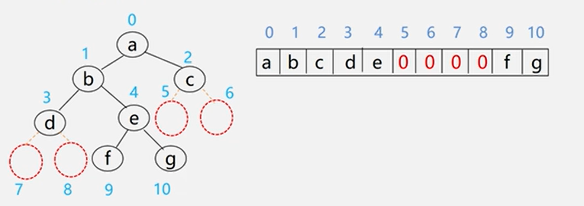

## 数据结构(C语言版)
### 类C语言基础
#### 结构体
```c
// 定义常量
#define MAX_SIZE 100

// 定义 ElemType 为 int 类型
typedef int ElemType;

// 定义结构体 SqList，包括两个成员
typedef struct {
    // data 是一个静态分配的数组，类型为 ElemType
    ElemType data[MAX_SIZE];  
    //ElemType *data;数组动态分配(malloc)
    // 表示数组中元素的实际个数
    int length;               
} SqList;

```
#### C分配空间
```c
// 引入标准库，支持内存分配和释放
#include <stdlib.h>

// 定义 SqList 变量 L
SqList L;

// 动态分配内存，分配 MAX_SIZE 个 ElemType 类型的空间
// malloc 成功时返回指向分配内存的指针，失败时返回 NULL
L.data = (ElemType *)malloc(sizeof(ElemType) * MAX_SIZE);

// sizeof(ElemType) 计算一个 ElemType 所占的字节数
// MAX_SIZE 表示需要分配的元素个数，总共分配 sizeof(ElemType) * MAX_SIZE 字节的内存

// 释放动态分配的内存
free(L.data);


```
#### C++分配空间
```c++
// 使用 new 分配内存，并将 int 类型变量初始化为 10
int *p = new int(10);

// 释放内存
delete p;


```

#### 参数传递

- **按值传递**：
    - 传递的是实参的副本，函数内部的修改不会影响实参。
    - 适用于基本数据类型，如整型、浮点型等。
  
- **按地址传递**：
    - 传递的是实参的地址，函数内部对形参的修改会影响实参。
    - 适用于指针变量、引用变量或数组名。
  
- **传递规则**：
   - 实参与形参的类型、个数、顺序必须完全一致。
---
### 一. 数据结构基础知识
- 数据: 能够被输入到计算机中,且能被计算机处理的符号的集合
- 数据元素:是数据的`基本单位`,是数据（集合）中的一个“个体”，在计算机中通常作为一个整体考虑
- 数据项:构成数据元素的不可分割的`最小单位`
- 数据对象:性质相同的数据元素的集合，如整数数据对象是所有整数的集合。 
```c
数据>数据对象>数据元素>数据项
数据对象={数据对象1,数据对象2,..}
```
- 数据结构:数据元素之间相互的关系
 1. 逻辑结构:数据元素之间的逻辑关系
 2. 物理结构/存储结构:数据元素之间关系在计算机内存之间的表示(映像)
 3. 运算与实现:对数据元素施加的操作

-逻辑结构分类:

 分类一:
 1. 线性结构:有且只有一个开始和结束端点,并且所有节点最多只有一个前驱和后继:线性表,栈,队列,串,字符串,数组,广义表等
 2.非线性结构:一个结点可能有多个前驱和后继:树,图等

分类二:

   1. 集合结构:数据元素同属一个集合,没有其他任何关系
   2. 线性结构:数据元素一对一关系
   3. 树形结构:数据元素一对多关系
   4. 图状结构(网状结构):数据元素多对多关系

存储结构分类:

 1. 顺序存储结构:用一组连续的存储单元依次存储数据元素,之间的逻辑关系由存储位置表示:C数组
 2. 链式存储结构:用一组任意的存储单元存储数据元素,逻辑关系用指针表示
 3. 索引存储结构:存储信息的同时建立索引表,通过索引来访问或操作元素
 4. 散列(hash)存储:通过哈希函数计算出元素存储位置
### 二. 算法和分析
- 算法:对特定问题的求解步骤与描述,是指令的有限序列
- 算法描述:自然语言,流程图,伪代码,程序语言
- 程序(数据结构+算法):是对算法的实现
- 算法特性:有穷性,确定性,可行性,输入(0/n),输出(1,n)
- 算法设计要求:正确性,可读性,健壮性,高效性
- 算法分析:
 1. 时间复杂度:算法执行时间T(n)=O(n)
    - 找语句频度(循环次数)最多的语句作
    - 计算并用n表示语句执行次数
    - 保留高次项忽略系数,得到最终结果
    - 用O(最终结果)表示时间复杂度
 2. 空间复杂度:算法所需存储空间的度量

 - 常见算法复杂度例子:
  1. O(1)
   ```c
    int x = 5;
    x = x + 1;  // O(1)

   ```
   2. O(n)
   ```c
    for (int i = 0; i < n; i++) {
    printf("%d\n", i);  // O(n)
    }

   ```
   3. O(log n)
   ```c
    例1.
    while (n > 1) {
    n = n / 2;  // O(log n)
    }
    例2.
    int i=1
    while(i<=n){
        i=i*2
    }
   ```
   4. O(n log n)
   ```c
   int n = 16;
    for (int i = 0; i < n; i++) {
        int x = n;
        while (x > 1) {
        x = x / 2;  // 内层对数操作
        printf("%d\n", x);
        }
    }


   ```

   5. O(n^2)
   ```c
   for (int i = 0; i < n; i++) {
    for (int j = 0; j < n; j++) {
        printf("%d\n", i + j);  // O(n^2)
        }
    }

   ```
   6. O(2^n)
   ```c
   int fib(int n) {
    if (n <= 1) return n;
    return fib(n - 1) + fib(n - 2);  // O(2^n)
    }

   ```
### 三. 线性表(一对一)
#### 1.线性表及其逻辑结构
- 定义:具有相同特性的数据元素的有限序列
- 结点:第一个结点只有后继,最后一个元素只有前驱,其他元素都只有一个前驱和后继,之间为线性关系
- 长度:线性表元素的个数叫线性表长度，没有任何元素的线性表称为空表
- 基本运算:
```c
初始化线性表 InitList(&L）：构造一个空的线性表L。 
销毁线性表 DestroyList(&L）：释放线性表L占用的内存空 间。
清除线性表 ClearList(&L)：清空线性表L中的所有元素。

判线性表是否为空表 ListEmpty(L）：若L为空表，则返回 真，否则返回假。 
求线性表的长度 GetLength(L) 返回L中元素个数n

获取线性表元素 GetElem(L ，i，&e）：用 e返回L中第 i（1≤i≤n）个元素的值。
定位查找 LocateElem(L，e)：返回L中第一个值域与e相等的逻 辑位序。若这样的元素不存在，则返回值为0。  
输出线性表 DispList(L)：线性表L不为空时，顺序显示L中各结点 的值域。

返回前驱元素 PriorElem(L,cur_e,&pre_e):线性表L已存在,且cur_e不是L的第一个元素,返回cur_e的前驱元素到pre_e,否则操作失败,pre_e无意义
返回后继元素 NextElem(L,cur_e,&pre_e):线性表L已存在,且cur_e不是L的最后元素,返回cur_e的后继元素到pre_e,否则操作失败,pre_e无意义

插入一个数据元素ListInsert(&L，i，e)：在L的第i（1≤i≤n） 个元素之前插入新的元素e，L的长度增1。 
删除数据元素 ListDelete(&L，i，&e）：删除L的第i（1≤isn） 个元素，并用e返回其值，L的长度减1。
遍历操作元素 ListTraverse(&L,visit())：依次对L中的每个元素调用函数visit(，依次访问L中的每个元素。

```
#### 2. 线性表的顺序存储表示和实现
- 顺序表:把逻辑上相邻的元素存储在相邻的存储单元的存储结构的线性表
- 基地址/起始地址:逻辑位序从1开始，物理位序从0开始
- 优点:存取密度大(1),可以随机存取表中的任一元素
- 缺点:在插入和删除某一元素时,需要移动大量元素,浪费存储空间,属于静态存储形式,数据元素的个数不能自由扩充
- 时间复杂度:插入删除算法的平均时间负责度是O(n)
- 访问元素方式:访问元素时, 直接通过下标访问 (随机访问)

- 实现:
```c
/*
线性表顺序表的表示和实现
逻辑顺序从1开始
物理顺序从0开始

*/
#include <stdlib.h>
#include <stdio.h>

// 定义宏函数结果状态码
#define TRUE 1
#define FALSE 0
#define OK 1
#define ERROR 0
#define INFEASIBLE -1
#define OVERFLOW -2
// 线性表存储空间的初始分配量
#define MAX_SIZE 100

// 自定义类型
typedef char ElemType;
typedef int Status;

// 定义顺序表结构体SqList
typedef struct
{
    ElemType data[MAX_SIZE]; // 元素
    int length;              // 线性表长度
} SqList;

// 线性表初始化InitList
void InitList(SqList **L)
{
    // 分配存放线性表的顺序表空间
    *L = (SqList *)malloc(sizeof(SqList));
    // 将线性表的长度设为0
    (*L)->length = 0;
}

// 创建顺序表
void CreateList(SqList **L, ElemType a[], int n)
{
    int i = 0;
    // 1. 分配存储空间
    *L = (SqList *)malloc(sizeof(SqList));
    // 2. 遍历数组a中的n个元素插入到顺序表中
    while (i < n)
    {
        (*L)->data[i] = a[i];
        i++;
    }
    (*L)->length = i;
}

// 清空线性表
void ClearList(SqList *L)
{
    // 设置长度为0则表元素无法访问操作==清空
    L->length = 0;
}

// 销毁线性表L
void DestroyList(SqList *L)
{
    // 释放线性表空间
    free(L);
}

// 判断线性表是否为空
Status ListEmpty(SqList *L)
{
    return L->length == 0 ? TRUE : FALSE;
}

// 获取线性表长度
int GetLength(SqList *L)
{
    return L->length;
}

// 遍历输出线性表
void DispList(SqList *L)
{
    // 如果为空表则直接退出
    if (ListEmpty(L))
        return;
    // 遍历输出各个元素
    for (int i = 0; i < L->length; i++)
    {
        printf("%c", L->data[i]);
    }
    printf("\n");
}

// 获取线性表第i个(逻辑从1)元素并返回给e
Status GetElem(SqList *L, int i, ElemType *e)
{
    // 将逻辑位置转换为物理索引
    i--;
    // 当索引<0或者>length-1时下标越界错误
    if (i < 0 || i > L->length - 1)
        return ERROR;
    *e = L->data[i];
    return OK;
}

// 在线性表查找第一个值为e的元素, 返回物理位置, 如果找不到返回0
int LocateElem(SqList *L, ElemType e)
{
    // 遍历元素
    for (int i = 0; i < L->length; i++)
    {
        // 如果找到与e 相同则返回该元素的逻辑位置(物理索引+1)
        if (L->data[i] == e)
            return i + 1;
    }
    // 查找不到返回0
    return 0;
}

// 在第i个位置插入元素e到顺序表L
Status ListInsert(SqList *L, int i, ElemType e)
{
    i--; // 1. 转换为物理位置
    // 2. 检查插入位置是否合法
    if (i < 0 || i > L->length)
        return ERROR;
    // 3. 当存储空间已满时返回false
    if (L->length == MAX_SIZE)
        return ERROR;
    // 4. 将索引i后面的元素依次后移
    for (int j = L->length - 1; j >= i; j--)
    {
        L->data[j + 1] = L->data[j];
    }
    // 5. 在索引i位置插入元素e
    L->data[i] = e;
    // 6. 更新表的长度+1, 返回成功
    L->length++;
    return OK;
}

// 删除线性表中的第i个元素并返回到e
Status ListDelete(SqList *L, int i, ElemType *e)
{
    i--; // 1. 转换为物理位置
    // 2. 检查删除位置是否合法
    if (i < 0 || i > L->length - 1)
        return ERROR;
    // 3. 获取要删除的元素
    *e = L->data[i];
    // 4. 将索引i后的元素依次前移
    for (int j = i; j < L->length - 1; j++)
        L->data[j] = L->data[j + 1];
    // 5. 更新表的长度-1, 返回成功
    L->length--;
    return OK;
}

```
#### 3. 线性表的链式存储表示和实现
- 链表:用一组物理位置任意的存储单元来存放线性表的数据元素(若干个结点),这组存储单元既可以是连续的,也可以是不连续的
- 链表的逻辑次序和物理次序不一定相同
- 每个结点包括由数据域和指针域(指向下一个元素的位置)组成
- 单链表:指针域只有一个
- 双链表:指针域有两个,前面的指针指向前一个结点,后面的指针指向后一个结点(尾指针后一个为NULL,头指针前一个为NULL)
- 循环链表:尾指针后面指向头指针,头指针前面指向尾指针

- 头指针->头节点->首元结点->...->尾结点->尾指针

- 头指针:单链表是由头指针唯一确定的,因此单链表可以用头指针的名字命名,指向第一个结点
- 头结点:指链表的首元结点附设的一个结点(可以省略)
-首元结点:指链表中存储第一个数据元素的结点
- 尾指针:最后一个元素的指针域为NULL
- 表示空表:无头节点时，头指针为空。有头结点时，头结点指针为空
- 头结点作用:便于首元节点处理，便于空表和非空表的统一处理
- 头节点数据域:可以为空，也可以存储线性表长度等附加信息。此节点不计入表长度
- 元素访问方式:访问元素时.只能通过头指针进入链表，并通过每个结点指针以此向后扫描(顺序访问)
- 实现:
```c
/*
定义
声明结点类型和指向结点的指针
*/
typedef char ElemType;  // 定义链表中的元素类型为char
#include <stdlib.h>
#include <stdio.h>
#include <stdbool.h>

// 定义链表结点结构体
typedef struct Lnode {
    ElemType data;      // 数据域，存储元素
    struct Lnode *next; // 指针域，指向下一个结点
} Lnode, *LinkList;     // Lnode为链表结点类型，LinkList为指向Lnode的指针类型

// 初始化链表：生成头结点，并将头指针指向头结点
bool InitList(LinkList *L) {
    *L = (LinkList)malloc(sizeof(Lnode));  // 分配内存，生成头结点
    if (*L == NULL) return false;          // 检查内存分配是否成功
    (*L)->next = NULL;                     // 将头结点的指针域置空
    return true;                           // 初始化成功返回true
}

// 判断链表是否为空：检查头结点的指针域是否为空
bool isEmpty(LinkList L) {
    return L->next == NULL;  // 如果头结点的next为空，链表为空
}

// 销毁链表：释放所有结点的内存
bool DestoryList(LinkList *L) {
    Lnode *p;                // 临时指针用于遍历链表
    while (*L) {             // 遍历整个链表
        p = *L;              // 记录当前结点
        *L = (*L)->next;     // 移动到下一个结点
        free(p);             // 释放当前结点的内存
    }
    *L = NULL;               // 最后将头指针置空
    return true;             // 销毁成功
}

// 清空链表：仅删除链表的元素，保留头结点
bool ClearList(LinkList L) {
    Lnode *p, *q;
    p = L->next;             // 从头结点的下一个结点开始
    while (p) {              // 遍历链表，释放每个结点
        q = p->next;         // 保存下一个结点
        free(p);             // 释放当前结点
        p = q;               // 移动到下一个结点
    }
    L->next = NULL;          // 头结点的指针域置空
    return true;             // 清空成功
}

// 计算链表长度：遍历链表，统计结点数
int ListLength(LinkList L) {
    Lnode *p = L->next;      // 从头结点的下一个结点开始
    int i = 0;               // 计数器
    while (p) {              // 遍历链表
        i++;                 // 计数器加一
        p = p->next;         // 移动到下一个结点
    }
    return i;                // 返回链表长度
}

// 获取第i个元素：找到第i个结点，将数据存入e
bool GetElem(LinkList L, int i, ElemType *e) {
    Lnode *p = L->next;      // 从第一个数据结点开始
    int j = 1;               // 计数器，从1开始
    while (p && j < i) {     // 遍历直到找到第i个结点
        p = p->next;         // 移动到下一个结点
        j++;
    }
    if (!p || j > i)         // 如果没有找到或超出范围
        return false;        // 返回false
    *e = p->data;            // 取出第i个结点的数据
    return true;             // 获取成功
}

// 查找元素e在链表中的位置：返回位置或0（未找到）
// 时间复杂度:O(n)
int LocateElemPos(LinkList L, ElemType e) {
    Lnode *p = L->next;      // 从第一个数据结点开始
    int j = 1;               // 位置计数器
    while (p && p->data != e) {  // 遍历链表，查找元素
        p = p->next;         // 移动到下一个结点
        j++;
    }
    if (p)                   // 如果找到元素
        return j;            // 返回位置
    else
        return 0;            // 否则返回0，表示未找到
}

// 在第i个位置插入新元素e
// 时间复杂度O(n)
bool ListInsert(LinkList L, int i, ElemType e) {
    Lnode *s, *p = L;        // s为新结点，p用于遍历
    int j = 0;               // 计数器，从0开始
    while (p && j < i - 1) { // 遍历到第i-1个结点
        p = p->next;
        j++;
    }
    if (!p || j > i - 1)     // 如果位置不合法
        return false;        // 插入失败
    s = (LinkList)malloc(sizeof(Lnode)); // 分配内存给新结点
    s->data = e;             // 新结点的数据域赋值为e
    s->next = p->next;       // 将新结点的next指向原第i个结点
    p->next = s;             // 将第i-1个结点的next指向新结点
    return true;             // 插入成功
}

// 删除第i个元素，并将删除的元素值赋给e
// 时间复杂度O(n)
bool ListDelete(LinkList L, int i, ElemType *e) {
    Lnode *p = L, *q;        // p用于遍历，q用于保存待删除结点
    int j = 0;               // 计数器，从0开始
    while (p->next && j < i - 1) { // 遍历到第i-1个结点
        p = p->next;
        j++;
    }
    if (!p->next || j > i - 1) // 如果位置不合法
        return false;          // 删除失败
    q = p->next;               // 记录待删除的结点
    p->next = q->next;         // 使p的next跳过q，指向q的下一个结点
    *e = q->data;              // 将删除的结点的数据赋给e
    free(q);                   // 释放q的内存
    return true;               // 删除成功
}

// 头插法:输入n个数据,插入到链表头部
//时间复杂度:O(n)
void CreateList_H(LinkList L, int n) {
    Lnode *p;
    // 分配头结点内存并初始化
    L = (LinkList)malloc(sizeof(Lnode));  
    L->next = NULL;  // 初始化链表为空，即头结点的next指向NULL

    // 循环n次，进行头插法
    for (int i = n; i > 0; --i) {
        p = (LinkList)malloc(sizeof(Lnode));  // 为新节点分配内存
        scanf("%d", &p->data);  // 获取新元素p的值

        p->next = L->next;  // 新节点p的next指向当前链表的首元节点
        L->next = p;  // 更新头结点的next为新插入的节点p
    }
}


//尾插法:输入n个数据,插入到链表头部
void CreateList_Rear(LinkList L, int n) {
    Lnode *p, *r;
    // 分配头结点内存并初始化
    L = (LinkList)malloc(sizeof(Lnode));  
    L->next = NULL;  // 初始化链表为空，即头结点的next指向NULL

    r = L;  // r始终指向当前链表的最后一个节点，开始时指向头结点

    // 循环n次，进行尾插法
    for (int i = 0; i < n; ++i) {
        p = (LinkList)malloc(sizeof(Lnode));  // 为新节点分配内存
        scanf("%d", &p->data);  // 获取新元素p的值

        p->next = NULL;  // 新插入的节点作为链表的最后一个节点，next指向NULL
        r->next = p;  // 当前最后一个节点的next指向新插入的节点
        r = p;  // r更新为新插入的节点，即当前链表的尾节点
    }
}

```
#### 4. 循环链表
- 定义: 循环链表是一种链表的变体，其中最后一个节点指向链表的头节点，形成一个闭环。
- 循环链表的特点

  - 没有终止节点：与普通链表不同，循环链表的尾节点指向头节点。

  - 遍历便利：可以从任意节点开始遍历整个链表。

  - 适用于环形数据：适合实现环形队列、游戏中的玩家轮流等场景
  - 判断空表 p->next == L
- 实现
```c
//   尾指针R表示循环链表
//   头结点:R->next
//   首元结点:R->next->next
//   尾结点:R


#include <stdio.h>
#include <stdlib.h>

typedef struct Node {
    int data;               // 节点数据
    struct Node* next;      // 指向下一个节点的指针
} Node, *LinkList;

// 连接两个链表 L1 和 L2，并返回连接后的循环链表的头指针
LinkList Connect(LinkList L1, LinkList L2) {
    // 如果 L1 为空，直接返回 L2
    if (L1 == NULL) {
        return L2;
    }

    // 如果 L2 为空，直接返回 L1
    if (L2 == NULL) {
        return L1;
    }

    // 找到 L1 的尾节点
    LinkList p = L1; // 指向 L1 的头节点
    while (p->next) {
        p = p->next; // 移动到下一个节点
    }

    // 将 L1 的尾节点连接到 L2 的头节点
    p->next = L2; // 连接 L1 的尾部到 L2 的头部

    // 形成循环：将 L2 的最后一个节点指向 L1 的头节点
    LinkList q = L2; // 指向 L2 的头节点
    while (q->next != NULL) {
        q = q->next; // 找到 L2 的尾节点
    }
    q->next = L1; // 连接 L2 的尾部到 L1 的头部

    return L1; // 返回连接后的循环链表的头指针 L1
}
```
#### 5.双向链表
- 双向链表是一种链表结构，其中每个节点都包含三个部分：数据部分、指向前一个节点的指针、指向后一个节点的指针。双向链表允许从两端（前向和后向）遍历。
- 双向循环链表是双向链表的一种特殊形式，其中每个节点都可以从任一方向访问，并且链表的尾节点与头节点相连，形成一个环。这样，你可以从链表的任意节点开始遍历，而不需要担心到达链表的末尾。
-实现
```c
typedef struct DulNode {
    ElemType data;
    struct DulNode *prior,*next; // prior指向前驱节点和next后继节点的指针
}DulNode,*DuLinkList;
//DulNode 是 struct DulNode 的别名，方便在程序中直接使用 DulNode 来代替 struct DulNode，不必每次都写 struct。
//*DuLinkList 定义了一个指向 DulNode 类型节点的指针类型，表示链表的头指针，方便用 DuLinkList 来表示整个双向链表的指针。

DulNode* GetElemP_Dul(DuLinkList L, int i) {
    // 获取双向链表 L 中第 i 个节点的指针
    // 如果 i 不合法（<=0 或 > 链表长度），返回 NULL

    if (i <= 0) {
        // 如果 i 是无效位置（小于或等于 0），返回 NULL
        return NULL;
    }

    DuLinkList p = L->next;  // 初始化 p，指向链表的第一个节点（跳过头节点）
    int j = 1;               // 计数器 j，表示当前位置

    // 遍历链表，寻找第 i 个节点
    while (p && j < i) {
        p = p->next;  // 继续向后遍历链表
        j++;          // 更新计数器
    }

    // 如果找到第 i 个节点，返回节点指针；否则返回 NULL
    return (p && j == i) ? p : NULL;
}


// 在循环链表第i个位置中插入元素e，
bool ListInsert_Dul(DuLinkList &L, int i, ElemType e) {
    // 在双向链表 L 的第 i 个位置前插入元素 e

    if (!(p = GetElemP_Dul(L, i))) 
        // 调用 GetElemP_Dul 函数，获取第 i 个位置的节点指针 p
        // 如果 p 为空，表示第 i 个位置不存在，插入失败，返回 false
        return false;

    DuLinkList s = (DuLinkList)malloc(sizeof(DulNode)); 
    // 分配一个新节点 s 的内存

    s->data = e; 
    // 将新节点 s 的数据域赋值为 e

    s->prior = p->prior; 
    // 新节点 s 的前驱指向 p 的前驱节点

    p->prior->next = s; 
    // p 的前驱节点的后继指针指向新节点 s

    s->next = p; 
    // 新节点 s 的后继指向 p

    p->prior = s; 
    // p 的前驱指针更新为新节点 s

    return true; 
    // 插入成功，返回 true
}
// 在循环链表删除第i个位置的元素e，并返回删除的元素O(n)
bool ListDelete_Dul(DuLinkList &L, int i, ElemType &e) {
    // 从双向链表 L 中删除第 i 个节点，并将删除的节点数据赋值给 e

    if (!(p = GetElemP_Dul(L, i))) 
        // 调用 GetElemP_Dul 函数，获取链表中第 i 个节点的指针 p
        // 如果 p 为 NULL，表示第 i 个节点不存在，删除失败，返回 false
        return false;

    p->prior->next = p->next;
    // 将 p 的前驱节点的 next 指针指向 p 的后继节点，跳过 p

    p->next->prior = p->prior;
    // 将 p 的后继节点的 prior 指针指向 p 的前驱节点，双向链表重新连接
    // 如果 p 是最后一个节点，这一步可能会出现空指针访问错误，需要加判断

    e = p->data;
    // 将 p 节点的数据赋值给 e，供函数外部使用

    free(p);
    // 释放 p 节点占用的内存

    return true;
    // 删除成功，返回 true
}


```
#### 6.应用与总结
- 单链表、循环链表和双向链表在不同操作下的时间复杂度:

| 链表类型                          | 查找表头结点（首元结点） | 查找表尾结点                            | 查找结点 *P 的前驱结点                      |
| --------------------------------- | ------------------------ | --------------------------------------- | ------------------------------------------- |
| 带头结点的单链表 L                | L->next 时间复杂度 O(1)  | 从 L->next 依次向后遍历 时间复杂度 O(n) | 通过 p->next 无法找到其前驱                 |
| 带头结点仅设头指针 L 的循环单链表 | L->next 时间复杂度 O(1)  | 从 L->next 依次向后遍历 时间复杂度 O(n) | 通过 p->next 可以找到其前驱 时间复杂度 O(n) |
| 带头结点仅设尾指针 R 的循环单链表 | R->next 时间复杂度 O(1)  | R 时间复杂度 O(1)                       | 通过 p->next 可以找到其前驱 时间复杂度 O(n) |
| 带头结点的双向循环链表 L          | L->next 时间复杂度 O(1)  | L->prior 时间复杂度 O(1)                | p->prior 时间复杂度 O(1)                    |
- 顺序表与链表区别

| 特性/操作                  | 顺序表                            | 链表                                    |
| -------------------------- | --------------------------------- | --------------------------------------- |
| **存储结构**               | 连续的内存块                      | 非连续，使用指针链接节点                |
| **内存利用率**             | 固定大小，可能有空闲空间          | 动态分配，无空闲空间浪费                |
| **访问方式**               | 随机访问，直接通过下标访问        | 需要从头节点顺序查找                    |
| **时间复杂度（访问元素）** | O(1) 随机访问                     | O(n) 逐个遍历                           |
| **插入元素**               | 需要移动元素，平均时间复杂度 O(n) | 在任意位置插入，时间复杂度 O(1)         |
| **删除元素**               | 需要移动元素，平均时间复杂度 O(n) | 删除某节点，时间复杂度 O(1)             |
| **存储空间**               | 预先分配，可能需要扩容或缩容      | 动态分配，灵活使用内存                  |
| **空间效率**               | 可能浪费空间                      | 节省空间，无需多余存储                  |
| **扩展性**                 | 扩展需重新分配内存，代价高        | 可随时扩展，代价低                      |
| **适用场景**               | 适合数据量固定且查询频繁          | 适合插入、删除频繁的场景                |
| **实现复杂度**             | 简单，直接通过数组实现            | 相对复杂，需处理指针和链表结构          |
| **存储密度**               | 存储密度高(1)                     | 存储密度较小(<1):需要额外的空间存储指针 |

> 存储密度=结点数据本身空间/结点占用空
##### 应用示例
- 线性表合并
```c 
问题: 线性表La 和 Lb 是两个集合A和B，要求一个新的集合A=AUB,要求元素不重复?
La=(1,2,3,4,6,7,8,9,10)
Lb=(2,3,5,8,10,11)


//顺序表实现
void union_List(SqList &La, SqList Lb) {
    // 获取La的长度
    La_len = ListLength(La);
    // 获取Lb的长度
    Lb_len = ListLength(Lb);

    // 遍历Lb中的每一个元素
    for(i = 1; i <= Lb_len; i++) {
        // 获取Lb中的第i个元素返回到e
        GetElem(Lb, i, e);
        
        // 如果La中不存在该元素，则插入到La的末尾
        if(!LocateElem(La, e) == 0) {
            ListInsert(La, La_len + 1, e);
        }
    }
}


//链表实现
void union_LinkList(Lnode * La, Lnode Lb) {
    LinkList * temp = Lb.head; // 从Lb的头节点开始遍历

    // 遍历Lb中的每一个元素
    while (temp != NULL) {
        // 如果La中不存在该元素，则插入到La的末尾
        if (LocateElem(*La, temp->data) == 0) {
            ListInsert(La, ListLength(*La),temp->data);
        }
        temp = temp->next; // 移动到下一个节点
    }
}

```
- 有序表的合并
```c
问题:已知线性表La和Lb是两个有序表，要求合并两个有序表，得到一个新的有序表Lc，要求合并后Lc仍然有序且不重复。
La=(1,2,3,4,6,7,8,9,10)
Lb=(2,3,5,8,10,11)
//顺序表实现
SqList union_List(SqList &La, SqList Lb) {
    

}

```
### 四. 栈与队列
#### 1.定义
- 栈与队列是只能从表端点(两端)进行插入或删除操作的线性表
- 栈遵循 `后进先出`表，队列遵循`先进先出`表
- 栈和队列是线性表的子集

#### 2.栈的存储结构及其实现
- 栈（Stack）是一种后进先出（LIFO，Last In First Out）的数据结构，意味着最后入栈的元素最先出栈。
- 栈的常用术语:
  - 允许进行插入、删除操作的一端称为栈顶。表的另一端称为栈底。
  - 当栈中没有数据元素时，称为空栈。top=-1
  - 栈的插入操作通常称为进栈或入栈。 
  - 栈的删除操作通常称为退栈或出栈。

- 样式: top 指针始终指向栈顶元素所在的位置:`元素1, 元素2, ..., 元素n <- top`

- 几种基本运算:
```c
// 初始化栈
bool InitStack(SqStack *s) 
// 判断栈是否为空
bool IsEmpty(SqStack *s)
// 判断栈是否已满
bool IsFull(SqStack* s) 
//返回栈的长度
int StackLength(SqStack *s)
// 入栈操作
bool Push(SqStack *s, ElemType e) 
// 出栈操作
bool Pop(SqStack *s,ElemType *e) 
//销毁栈
bool DestroyStack(SqStack *&s)
//清空栈
bool ClearStack(SqStack *s)
//查看栈顶元素
bool GetTop(SqStack *s,ElemType *e)
```
- 顺序栈实现:
```c
//定义栈的结构体
#include <stdio.h>
#include <stdlib.h>
#include <stdbool.h>

#define MAX_SIZE 100  // 栈的最大容量

// 定义栈中元素的数据类型
typedef int ElemType;  // 这里缺少分号

// 定义栈的结构体
typedef struct {
    ElemType data[MAX_SIZE];  // 用数组存储栈中的元素
    int top;                  // 栈顶指针，指向栈顶元素的索引
} SqStack;

// 初始化栈
bool InitStack(SqStack **s) {  // 修改参数为指向指针，以便正确初始化
    *s = (SqStack *)malloc(sizeof(SqStack));  // 分配一个 SqStack 的空间
    if (*s == NULL) {
        return false;  // 如果分配失败，返回 false
    }
    (*s)->top = -1;  // 栈顶初始化为 -1，表示栈为空
    return true;     // 初始化成功
}

// 判断栈是否为空
bool IsEmpty(SqStack *s) {
    return s->top == -1;  // 栈顶为 -1 时，表示栈为空
}

// 判断栈是否已满
bool IsFull(SqStack* s) {
    return s->top == MAX_SIZE - 1;  // 如果栈顶等于最大容量 - 1，则栈满
}

// 返回栈的长度
int StackLength(SqStack *s) {
    return s->top + 1;  // 栈的长度等于栈顶指针 + 1
}

// 入栈操作
bool Push(SqStack *s, ElemType e) {
    if (IsFull(s)) {
        return false;  // 如果栈满，则无法入栈
    }
    s->data[++(s->top)] = e;  // 先移动栈顶指针，再存入元素
    return true;              // 入栈成功
}

// 出栈操作
bool Pop(SqStack *s, ElemType *e) {
    if (IsEmpty(s)) {
        return false;  // 如果栈空，则无法出栈
    }
    *e = s->data[(s->top)--];  // 取出栈顶元素，并将栈顶指针下移
    return true;                // 出栈成功
}

// 销毁栈, 释放空间
bool DestroyStack(SqStack **s) {
    if (*s == NULL) {
        return false;  // 如果栈指针为空，销毁失败
    }
    free(*s);  // 释放栈的内存
    *s = NULL;  // 将栈指针置为 NULL，防止悬挂指针
    return true;  // 销毁成功
}

// 清空栈
bool ClearStack(SqStack *s) {
    s->top = -1;  // 将栈顶指针置为 -1，相当于清空栈
    return true;  // 清空成功
}

// 查看栈顶元素
bool GetTop(SqStack *s, ElemType *e) {
    if (IsEmpty(s)) {
        return false;  // 如果栈为空，无法获取栈顶元素
    }
    *e = s->data[s->top];  // 获取栈顶元素
    return true;           // 获取成功
}


```
- 链式栈实现
    - 头指针->栈顶
    - 不需要头节点:s->元素n
    - 空栈判断:s->next==NULL
    - 几乎不会出现栈满
    - 插入删除仅在栈顶处执行
```c
#include <stdio.h>
#include <stdlib.h>
#include <stdbool.h>

typedef int ElemType;  // 假设元素类型为 int

// 定义栈节点的结构体
typedef struct StackNode {
    ElemType data;               // 栈节点的数据
    struct StackNode *next;      // 指向下一个节点的指针
} StackNode, *LinkStack;

// 初始化栈
bool InitStack(LinkStack *S) {
    *S = NULL;  // 链式栈的初始状态为空栈
    return true;
}

// 判断栈是否为空
bool IsEmpty(LinkStack S) {
    return S == NULL;  // 如果栈顶指针为 NULL，则栈为空
}

// 链式栈基于链表，不存在栈满的情况，所以 IsFull 函数总是返回 false
bool IsFull(LinkStack S) {
    return false;  // 链式栈不会满，除非系统内存不足
}

// 返回栈的长度
int StackLength(LinkStack S) {
    int length = 0;
    StackNode *p = S;
    while (p != NULL) {
        length++;
        p = p->next;  // 遍历链表，计算节点数量
    }
    return length;
}

// 入栈操作
bool Push(LinkStack *S, ElemType e) {
    StackNode *newNode = (StackNode *)malloc(sizeof(StackNode));  // 创建新节点
    if (newNode == NULL) {
        return false;  // 内存分配失败，无法入栈
    }
    newNode->data = e;           // 设置新节点的数据
    newNode->next = *S;          // 新节点的 next 指向当前栈顶
    *S = newNode;                // 栈顶指针指向新节点
    return true;
}

// 出栈操作
bool Pop(LinkStack *S, ElemType *e) {
    if (IsEmpty(*S)) return false;  // 栈为空，无法出栈

    StackNode *p = *S;              // 临时保存栈顶节点
    *e = p->data;                   // 将栈顶节点的数据赋值给 e
    *S = p->next;                   // 栈顶指针指向下一个节点
    free(p);                        // 释放栈顶节点的内存
    return true;
}

// 销毁栈
bool DestroyStack(LinkStack *S) {
    StackNode *p;
    while (*S != NULL) {
        p = *S;                   // 保存当前栈顶节点
        *S = (*S)->next;         // 栈顶指针指向下一个节点
        free(p);                 // 逐个节点释放内存
    }
    return true;
}

// 清空栈
bool ClearStack(LinkStack *S) {
    DestroyStack(S);  // 清空栈可以视为销毁栈的行为
    return true;      // 清空栈后返回 true
}

// 查看栈顶元素
bool GetTop(LinkStack S, ElemType *e) {
    if (IsEmpty(S)) {
        return false;  // 栈为空，无法读取栈顶元素
    }
    *e = S->data;  // 获取栈顶元素
    return true;
}


```
#### 3 .队列的存储结构及其实现
- 队列（Queue）是一种先进先出（FIFO, First In First Out）的线性数据结构。这意味着第一个进入队列的元素最先被移出。它类似于生活中的排队现象，先到的人先被服务。(头删尾插)

- 样式: `front -> 元素1, 元素2, ..., 元素n <- rear`


- 假溢出问题:普通队列头指针不为0,队尾指针到达MAX_SIZE时,队列中还有空闲空间。但而无法插入新元素

  - 解决1:循环队列通过将队尾指针到达数组末尾后循环回到数组开头(rear%MAX_SIZE)

       - 判空:front == rear
     - 判满:1.舍去一个存储位置(rear + 1) % size == front 2.使用一个标识当前队列长度的变量
       - 获取长度:循环队列可能出现rear<front: 
         (q->rear - q->front + MAX_SIZE) % MAX_SIZE
  
  - 解决2:动态扩容:当队列即将溢出时，创建一个更大的数组，并将原有的元素复制到新数组中。

队列的基本操作：
```c
//初始化
bool InitQueue(SqQueue* q) 
//获取长度
int QueueLength(SqQueue* q) 
//判断队列是否为空
bool IsEmpty(SqQueue* q)
// 判断队列是否已满
bool isFull(SqQueue* q) 
// 入队操作
bool enqueue(SqQueue* q, ElemType e) 
// 出队操作
bool dequeue(SqQueue* q,ElemType &e)
// 获取队头元素
bool getFront(SqQueue* q) 
```
- 顺序实现(循环队列)
```c
#include <stdio.h>
#include <stdlib.h>

#define MAX_SIZE 100  // 队列的最大容量

// 定义队列中元素的数据类型
typedef int ElemType;

// 队列结构体定义
typedef struct {
    ElemType data[MAX_SIZE];  // 存储元素的数组
    int front;                // 队头指针
    int rear;                 // 队尾指针
} SqQueue;

// 初始化队列 
bool InitQueue(SqQueue** q) {  // 修改为指向指针，以便在外部使用
    *q = (SqQueue*)malloc(sizeof(SqQueue));  // 分配队列结构体空间
    if (*q == NULL) {
        return false;  // 检查内存分配是否成功
    }
    (*q)->front = 0;  // 队头指针初始为 0
    (*q)->rear = 0;   // 队尾指针初始为 0
    return true;
}

// 获取队列长度
int QueueLength(SqQueue* q) {
    // 获取长度: 循环队列可能出现 rear < front: (q->rear - q->front + MAX_SIZE) % MAX_SIZE
    return (q->rear - q->front + MAX_SIZE) % MAX_SIZE;
}

// 判断队列是否为空
bool IsEmpty(SqQueue* q) {
    // 头指针=尾指针, 两指针之间没有元素表示空队
    return q->front == q->rear;
}

// 判断队列是否已满
bool IsFull(SqQueue* q) { 
    // 少用一个空间, 尾指针 + 1 = MAX_SIZE
    // (尾指针 + 1) % MAX_SIZE = 头指针, 代表队满
    return (q->rear + 1) % MAX_SIZE == q->front;
}

// 入队操作
bool Enqueue(SqQueue* q, ElemType e) {
    // 如果队满, 返回 false
    if (IsFull(q)) return false;
    
    q->data[q->rear] = e;  // 将新元素插入队尾
    q->rear = (q->rear + 1) % MAX_SIZE; // 队尾指针加 1，循环队列需要取模
    return true;
}

// 出队操作
bool Dequeue(SqQueue* q, ElemType* e) {  // 修改为传指针，以便返回元素
    // 空队列则无法取出元素返回 false
    if (IsEmpty(q)) return false;
    
    *e = q->data[q->front];  // 取队头元素，给 e
    q->front = (q->front + 1) % MAX_SIZE; // 队头指针加 1，循环队列需要取模
    return true;
}

// 获取队头元素
bool GetFront(SqQueue* q, ElemType* e) {  // 修改为传指针，以便返回元素
    // 空队无法获取
    if (IsEmpty(q)) return false;
    
    *e = q->data[q->front];  // 返回队头元素
    return true;
}

// 清空队列
bool ClearQueue(SqQueue* q) {
    q->front = 0;  // 清空队列相当于重置 front 和 rear 指针
    q->rear = 0;
    return true;
}


```

- 链式实现

```c
#include <stdio.h>
#include <stdlib.h>

typedef int ElemType; // 假设元素类型为 int

// 链式队列节点结构体定义
typedef struct QNode {
    ElemType data;         // 节点的数据
    struct QNode *next;    // 指向下一个节点的指针
} QNode, *QueuePtr;

// 链式队列结构体定义
typedef struct {
    QueuePtr front;  // 队头指针
    QueuePtr rear;   // 队尾指针
} LinkQueue;

// 初始化队列
bool InitQueue(LinkQueue *q) {
    q->front = q->rear = (QueuePtr)malloc(sizeof(QNode));  // 创建头结点
    if (q->front == NULL) {
        return false;  // 检查内存分配是否成功
    }
    q->front->next = NULL;  // 初始化头结点的 next 指针
    return true;
}

// 获取队列长度
int QueueLength(LinkQueue *q) {
    int length = 0;
    QueuePtr p = q->front->next;  // 从头结点的下一个节点开始
    while (p != NULL) {
        length++;
        p = p->next;
    }
    return length;
}

// 判断队列是否为空
bool IsEmpty(LinkQueue *q) {
    return q->front == q->rear;  // 队列为空的条件是队头指针等于队尾指针
}

// 入队操作
bool Enqueue(LinkQueue *q, ElemType e) {
    QueuePtr p = (QueuePtr)malloc(sizeof(QNode));  // 分配新节点
    if (p == NULL) {
        return false;  // 检查内存分配是否成功
    }
    p->data = e;       // 设置新节点的数据
    p->next = NULL;    // 新节点的 next 指向 NULL
    q->rear->next = p; // 当前队尾的 next 指向新节点
    q->rear = p;       // 更新队尾指针
    return true;
}

// 出队操作
bool Dequeue(LinkQueue *q, ElemType *e) {
    if (IsEmpty(q)) {
        return false;  // 队列为空，无法出队
    }
    QueuePtr p = q->front->next;  // 保存队头节点
    *e = p->data;                 // 获取队头元素
    q->front->next = p->next;     // 更新队头指针
    if (q->rear == p) {           // 如果队列中只有一个节点，出队后队尾需要更新
        q->rear = q->front;
    }
    free(p);  // 释放队头节点
    return true;
}

// 销毁队列
bool DestroyQueue(LinkQueue *q) {
    while (q->front != NULL) {
        QueuePtr p = q->front->next;
        free(q->front);  // 逐个释放节点
        q->front = p;
    }
    q->rear = NULL;  // 队列销毁后，队尾指针置空
    return true;
}

// 获取队头元素
bool GetFront(LinkQueue *q, ElemType *e) {
    if (IsEmpty(q)) {
        return false;  // 队列为空，无法获取队头元素
    }
    *e = q->front->next->data;  // 返回队头元素
    return true;
}

```

### 串、数组与广义表的定义与实现
#### 串的定义
##### 串的基本概念
串(字符串)：由零个或者多个字符组成的有限序列，是内容受限的线性表(只能是字符),结尾为‘\0’
串名：接受字符串的变量/常量名
串值：双引号括起来的字符序列，双引号不是字符串内容，起标识作用

字符位置：字符在序列中的序号
串长：串中的字符个数
空串：长度为0的串

空格串(空白串)：构成串的所有字符都是空格,长度不为0
串相等：两个串`长度相等`且`各个对应位置字符都相等`。所有空串都相等

主串：包含子串称为主串
子串：一个串中`任意个连续字符`组成的子序列（含空串和自身）
真子串：不包含自身的子串
子串位置： 子串第一个字符在主串的位置


#### 串的类型定义、存储结构及运算
```c
// 串赋值
StrAssign(&s,chars)
//  串比较是否相等
StrCompare(s,t)
// 串求长 
StrLength(s)
//  串连接
Concats(t,s1,s2)
// 求子串
SubStr(s,i,j)
// 串拷贝
StrCopy(&s,t)
// 串判空
StrEmpty(s)
//  清空串
ClearStr(s)
//  返回子串的位置
Index(s,t,tops)
//  串替换
Replace(s,t,v)
// 子串插入
StrInsert(S,pos,t)
// 子串删除
StrDel(s,pos,len)
```
##### 串的顺序实现
```c
#define MAX_SIZE 255
typedef struct{
    char data[MAX_SIZE+1];
    int length;
}String;

//生成串
void StrAssign(String *s, const char *cstr) {
    int i = 0;
    while (cstr[i] != '\0' && i < MAX_SIZE - 1) {
        s->data[i] = cstr[i];
        i++;
    }
    s->length = i;
    s->data[i] = '\0'; // 以空字符结束
}

//串连接
void Concats(String *s, const String *t) {
    if (s->length + t->length < MAX_SIZE) {
        for (int i = 0; i < t->length && s->length + i < MAX_SIZE - 1; i++) {
            s->data[s->length + i] = t->data[i];
        }
        s->length += t->length;
        s->data[s->length] = '\0'; // 重新以空字符结束
    }
}
int StrLength(const String *s) {
    return s->length;
}

int StrEqual(const String *s, const String *t) {
    if (s->length != t->length) {
        return 0; // 不相等
    }
    for (int i = 0; i < s->length; i++) {
        if (s->data[i] != t->data[i]) {
            return 0; // 不相等
        }
    }
    return 1; // 相等
}

//字符串比大小(ASCII)
int Strcmp(const String *s, const String *t) {
    int minLength = s->length < t->length ? s->length : t->length;

    for (int i = 0; i < minLength; i++) {
        if (s->data[i] != t->data[i]) {
            return s->data[i] - t->data[i]; // 返回 ASCII 值差
        }
    }

    return s->length - t->length; // 如果前面的部分相同，比较长度
}
String SubStr(const String *s, int i, int j) {
    String sub;
    if (i < 1 || i + j - 1 > s->length) {
        sub.length = 0;  // Invalid range
        sub.data[0] = '\0'; // 空字符串
        return sub;
    }
    
    int index = i - 1; // 转换为 0 基索引
    for (int k = 0; k < j && k < MAX_SIZE - 1; k++) {
        sub.data[k] = s->data[index + k];
    }
    sub.length = j;
    sub.data[j] = '\0';  // Null-terminate the substring
    return sub;
}


void InsStr(String *s, int i, const String *t) {
    if (i < 1 || i > s->length + 1) return;  // Invalid position

    if (s->length + t->length < MAX_SIZE) {
        for (int j = s->length - 1; j >= i - 1; j--) {
            s->data[j + t->length] = s->data[j]; // 移动字符
        }
        for (int k = 0; k < t->length; k++) {
            s->data[i - 1 + k] = t->data[k]; // 插入字符
        }
        s->length += t->length;
        s->data[s->length] = '\0'; // 重新以空字符结束
    }
}


void DelStr(String *s, int i, int j) {
    if (i < 1 || i + j - 1 > s->length) return;  // Invalid range

    for (int k = i - 1; k + j < s->length; k++) {
        s->data[k] = s->data[k + j]; // 移动字符
    }
    s->length -= j;
    s->data[s->length] = '\0'; // 重新以空字符结束
}


//字符替换
void RepStr(String *s, int i, int j, const String *t) {
    DelStr(s, i, j); // 删除
    InsStr(s, i, t); // 插入
}


```
##### 串的链式实现

```c
可将多个连续的字符放在一个节点，以克服存储空间利用低的缺点

#define CHUNKSIZE 80

typedef struct Node {
    char data[CHUNKSIZE];                // 存储的字符
    struct Node *next;       // 指向下一个节点的指针
} Node;

typedef struct {
    Node *head,*tail;         // 链表头指针和尾指针
    int length;              // 字符串长度
} LString;


void StrAssign(LinkedString *s, const char *cstr) {
    // 释放原有链表
    Node *current = s->head;
    while (current != NULL) {
        Node *temp = current;
        current = current->next;
        free(temp);
    }

    s->head = NULL;
    s->length = 0;

    // 添加新字符
    while (*cstr) {
        Node *newNode = (Node *)malloc(sizeof(Node));
        newNode->data = *cstr++;
        newNode->next = s->head; // 插入到头部
        s->head = newNode;
        s->length++;
    }

    // 反转链表以保持顺序
    Node *prev = NULL, *next = NULL;
    current = s->head;
    while (current != NULL) {
        next = current->next;
        current->next = prev;
        prev = current;
        current = next;
    }
    s->head = prev; // 更新头指针
}
void RepStr(LinkedString *s, int i, int j, const char *t) {
    DelStr(s, i, j); // 删除
    for (int k = 0; t[k] != '\0'; k++) {
        InsStr(s, i + k, t[k]); // 插入
    }
}


```

#### 串的模式匹配
字符串查找：如果模式串是主串的子串，返回第一次出现的位置，反之返回－1
应用： 搜索引擎，拼写检查，语言翻译，数据压缩
##### Brute Force简单匹配算法
简单，经典，朴素，穷举，暴力的
通过逐个字符比对模式串与主串，直到找到匹配或遍历结束。
时间复杂度O(m*n)
```c
#include <stdio.h>
#include <string.h>

// BF模式匹配算法
int bf_Index(String *text, String *pattern) {
    int textLen = strlen(text);     // 获取文本串的长度
    int patternLen = strlen(pattern); // 获取模式串的长度

    // 从主串的每一个字符开始，逐一匹配模式串
    for (int i = 0; i <= textLen - patternLen; i++) {
        int j = 0;
        // 内层循环检查当前字符位置是否匹配模式串
        while (j < patternLen && text[i + j] == pattern[j]) {
            j++;
        }
        // 如果匹配到模式串末尾，返回匹配的起始位置
        if (j == patternLen) {
            return i;
        }
    }
    // 没有匹配，返回 -1
    return -1;
}

```
##### KMP算法
速度快
```c
#include <stdio.h>
#include <string.h>

get_next(String pattern){
// 模式串各个字符可以跳过的数量
// 即寻找子串中相同前后缀的长度,且为最长前后缀,不能为本身
    next=[0]
    prefix_len=0 //当前共同前后缀的长度
    int patternlen=StrLength(pattern)
    i=1
    while(i<patternlen){
        if(pattern[prefix_len]==pattern[i]){
            prefix_len+=1;
            next.append(prefix_len)
            i+=1    
        }else{
            if (prefix_len=0){
                next.append(0)
                i+=1
            }else{
                prefix_len=next[prefix_len-1]
            }
        }
    }
    return next


}

int kmp_Index(String text,String pattern){
    //当主串与模式串在索引为n个字符不匹配时,主串无需回溯,
    //模式串可以跳过next[n]个字符,继续比较
    next=get_next(pattern);
    
    i=0;//主串指针
    j=0;//模式串指针
    int textlen=StrLength(text);
    int patternlen=StrLength(pattern)

    while(i<textlen){
        if(text[i]==pattern[j]){
            //对应字符相等,指针向后移1
            i++;
            j++;
        }else if(j>0){
            // 对应字符不匹配,根据next跳过部分字符,继续比较
            j=next[j-1]
        }else{
            // 第一个字符就不匹配
            j+=i
        }
        if(j==patternlen){
            // 字串遍历完成(匹配成功),返回此时对应在主串的第一个字符
            return i-j
        }else{
            return -1
        }
    }

}


```


#### 数组的定义
- 数组是一种数据结构，可以存储固定数量的相同类型的元素的集合。是定长的线性表.
- 数组在内存中是连续分配的，因此可以通过索引来快速访问数组中的元素。
##### 数组的基本概念
- 数组元素个数不可变，定义后元素个数不会变化
- 数组中的数据元素有相同的数据类型
- 数组中每个元素都有唯一的下标对应。
- 数组是一种随机存储结构，可以随机存取数组中的任意数据元素。


#### 数组的类型定义、存储和实现
##### 基本操作
```c
// 初始化数组
InitArray(*A,n,e1,e2,...)
// 销毁数组
DestoroyArray(*A)
// 取数据元素
Value(A,*e,index1,index2,...)
// 给数组元素赋值
Assign(A,*e,index1,index2,...)
// 数组无法插入和删除元素
```
##### 一维数组
- 定义:可以存储`array_size`个`type`类型的元素。
```c
// 一维数组定义
type array[array_size]

- 计算第n个元素的存储地址(首元素从1开始):
// K为单个元素占用的空间
LOC(a[n])=LOC(a[1])+(n-1)*k
- 计算元素索引i的存储地址(首元素从0开始):
LOC(a[i])=LOC(a[0])+(i)*k
```
- 顺序实现    
```c

```
##### 二维数组
- 定义:二维数组是由多个一维数组组成的，可以看作一个矩阵。row_size是行数，col_size是列数。
```c
// 二维数组定义 
type array[row_size][col_size];
// 或者用一维数组嵌套
type arr1[row_size]; 
type arr1 arr2[col_size];


- 计算a[i][j]元素的存储地址(首元素从[1][1]开始)：
// m*n为行列元素个数,i,j为索引,k为单个元素占用空间
- 以行计算:
LOC(a[i][j])=LOC(a[1][1])+((i-1)*n+(j-1))*k
- 以列计算:
LOC(a[i][j])=LOC(a[1][1])+((j-1)*m+(i-1))*k

- 计算a[i][j]元素的存储地址(首元素从[0][0]开始)：
- 以行计算:
LOC(a[i][j])=LOC(a[0][0])+(i*n+j)*k
- 以列计算:
LOC(a[i][j])=LOC(a[1][1])+(j*m+i))*k
```

- 特殊矩阵：对称矩阵：a[i][j]=a[j][i]，
    - 压缩存储：只用存储主对角线和上/下三角的元素;
    - 元素数:n(n+1)/2
- 特殊矩阵；上/下三角矩阵:  对角线(不包括)以上或者以下全为常数C,其余为0
    - 压缩存储：只用存储上/下三角元素，其他元素均为0
- 特殊矩阵：对角矩阵: 对角线为非零元素，其余为0
    - 压缩存储：只存储对角线元素，其余为0
- 稀疏矩阵：非零元素比较少，分布没有规律：
    - 三元组法:只存储非零元素(row,col,value),其余元素为0;
    row:行号，col:列号，value:元素值
    - 十字链表:只存储非零元素(row,col,value,down,right),其余为0;
    right:指向同一行的下一个非零元素，
    down:指向同一列下一个非零元素;


#### 广义表的定义
- 广义表/列表：是有限个元素的序列，其逻辑结构用括号表示法
- 广义表是线性表的推广，线性表是广义表的特例
##### 广义表的基础概念 
- 存储特点：
    - 可以包含原子元素(小写字母)（如整数、字符、符号等）。
    - 可以包含子表（即其他广义表(大写字母)）。
    - 可以为空表（即没有任何元素）。
    - 可以兼容线性表,数组,树和有向图等数据类型
- 次序:一个直接前驱和一个直接后继
- 长度:最外层元素个数
- 深度：括号的层数，原子的深度为0，空表的深度为1
- 表头和表尾：表头为第一个元素a1，除表头其余元素为表尾,只有一个元素的广义表既是表头也是表尾.
- 空表：没有任何原子的广义表。无表头无表尾
- 共享 :可以通过名称引用已存在的广义表 
- 递归:广义表可以是递归的表(F=(a,F)=(a,(a,(a,...))))广义表递归长度有限,深度无穷
- 多层次的:可以用图形表示成树形结构
#### 广义表的类型定义、存储和实现
##### 基础运算
```c
//求表头
GetHead(L)
//求表尾
GetTail(L)
```
### 树与二叉树
#### 树的定义
- 树(Tree)是n(>=0)个节点的有限集合,是`非线性数据结构`,是一对多的.
- 树具有以下性质：
    - 每个节点之间有分支，具有层次关系
    - 结点数n=0,称为空树
    - n>0时
        - 有且仅有一个根(Root)节点
        - 其余结点可分为m(>=0)互不相交的有限集T1,T2,...
        - 根的子树:每个集合T本身也是一课树
    - 树是n个结点的有限集,是递归的定义

##### 树的基本术语
- 根结点:没有前驱的结点
- 结点:数据元素及指向子树的分支
- 根结点:非空树中无前驱的结点
- 结点的度:结点拥有的子树个数
- 树的度(分支/边):树中各结点最大值
- 终端结点(叶子):度为0的结点
- 非终端结点:度!=0的结点
- 内部结点:除根节点的非终端结点
- 路径长度：结点数－1
- 公式:
  - 树的(度)分支数=度为0的结点树(叶子结点)+度不为0的结点数(度不为0)=k*n+k1*n1+k2*n2+...+km*nm(k为度为0的结点数,k1为度为1的结点数,k2为度为2的结点数,km为度为m的结点数)
  - 树的总结点数=所有结点的度之和+1
  - 叶子结点数=树的总结点树-其他结点数
  - 

- 结点关系:
    - 在树结构中，一个节点的上一级节点称为它的父节点。
    - 一个节点的直接下一级节点称为它的子节点。
    - 同一父节点下的节点互称为兄弟节点。
    - 具有相同祖父节点但父节点不同的节点称为堂兄弟节点。
    - 一个节点从根节点到该节点路径上的所有上级节点称为它的祖宗节点。
    - 一个节点的所有子树中的结点称为该节点子孙结点
    

- 树的层号(高度):从根结点开始,每经过一个分支,层号加一,根结点的层号为0
- 有序树与无序树：
    - 有序树：树中结点子树从左到右有次序(最坐标为第一个孩子)
    - 无序树：树中各结点各子树无次序
- 森林:m个互不相交的树的集合,m>0.
    - 树->森林:一棵树删除根节点也是森林,可以看成特殊的森林
    - 森林->树:给森林的多个子树增加双亲结点变成树
##### 树结构与线性结构的区别

| **属性**       | **树结构**                                           | **线性结构**                                   |
| -------------- | ---------------------------------------------------- | ---------------------------------------------- |
| **定义**       | 层级关系的数据结构，节点之间存在父子关系             | 顺序排列的数据结构，元素之间具有线性关系       |
| **数据关系**   | 多对多关系，具有分支结构，可以有多个子节点           | 一对一关系，只有前驱和后继元素                 |
| **组织形式**   | 非线性结构，数据组织呈树形分层                       | 线性结构，数据组织呈直线型                     |
| **访问方式**   | 通过递归或遍历（如前序、中序、后序、层序）           | 顺序访问（如从头到尾）                         |
| **存储特点**   | 通常通过链式结构实现，节点中包含指向子节点的指针     | 可以是连续存储（数组）或链式存储（链表）       |
| **操作复杂度** | 查找和插入复杂度取决于树的高度（平衡树为 `O(log n)`) | 顺序访问复杂度为 `O(n)`，随机访问数组为 `O(1)` |
| **示例结构**   | 二叉树、B 树、红黑树、Trie 树                        | 数组、链表、队列、栈                           |
| **典型应用**   | 文件系统、数据库索引、编译器语法树、路由表           | 简单列表、队列操作、堆栈计算                   |
| **扩展性**     | 容易扩展，适合动态变化的数据                         | 结构简单，扩展时可能需要大量移动元素           |
| **节点关系**   | 父节点、子节点、兄弟节点等多层级关系                 | 每个元素只有前驱和后继，线性无分支             |
| **遍历算法**   | 复杂，如 DFS（深度优先）、BFS（广度优先）            | 简单，如从头到尾依次遍历                       |

总结
- **树结构**适用于需要描述层次关系或快速查找的场景，如目录结构或数据库索引。
- **线性结构**适用于顺序处理、简单的数据操作，如列表操作和临时数据存储。

#### 二叉树的定义
二叉树：是n(>=0)个结点的有限集，由一个根节点和两个互不相交的(左/右)子树组成

- 特点
    - 每个结点最多有2个分支
    - 有序树：子树必须有左右之分(即使只有一个子树)，次序不能颠倒
    - 二叉树可以是空集合，可以有空的左/右子树
    - 结构最简单，规律性最强
    - 任何树都可以和二叉树相互转换，不失一般性
- 二叉树的五种基本形态


##### 二叉树的性质
- 性质1:二叉树第i层上最多有2^(i-1)个结点(i>=1),最少有1个结点 
- 性质2:高度为k的二叉树最多有2^k -1个结点(k>=1),最少k个结点
- 性质3:二叉树,叶子数为n0, 度为2的结点数为n2,则满足: n0=n2+1

- 更多性质:
  - 性质：树的叶子结点数=树的总度-度数>=1的结点数

  - 性质:高度为h的m次树至多有(m^(h-1))/(m-1)个结点
  
  - 性质:具有n个结点的m次树的最小高度为： 向下取整[log m (n(m-1))] +1
  

##### 特殊二叉树
- 满二叉树:
    - 每一层的结点数都达到最大值`(每层都满)`，即所有非叶子结点的度都为2。
    - 叶子节点的度为0(最底层)，而每个非叶子节点的度为2。
    - 满二叉树的一个特点是它的节点数满足n=2^h -1 (n为树的度，h为树高)
    
- 完全二叉树(满二叉树叶子去除右):
    - 除了叶子节点，每层都满。叶子结点的右边可以被`连续删除`若干个。`(编号连续)`
    - 叶子只会在最大两层
    - 对于任意结点,若右子树最大层为n，则左子树最大层为n或n-1。
    - 性质4 : n个结点的完全二叉树的树高度至少: h=向下取整[log 2(n)]+1,至多为n
    - 性质5: 一棵n个结点的完全二叉树,对于任意结点编号i(1<=i<=n),则:
      - (1)i=1,为根结点
      - (2)i>1,则i的父结点为:向下取整[i/2]
      - (3)2i>n,则i为叶子结点.否则,左子结点为2i
      - (4)2i+1>n,无右.否则,右子结点为2i+1
    

- 满二叉树->完全二叉树
##### 二叉树与树的区别
| 特性             | 二叉树                           | 一般树                                 |
| ---------------- | -------------------------------- | -------------------------------------- |
| **节点子节点数** | 每个节点最多有两个子节点         | 每个节点可以有任意多个子节点           |
| **子节点类型**   | 包含左子节点和右子节点           | 不区分子节点的类型                     |
| **递归定义**     | 二叉树的每个节点只有左、右子树   | 树的每个节点可以有多个子树             |
| **用途**         | 广泛用于二叉搜索树、堆等结构     | 适用于表示更灵活的层级结构，如文件系统 |
| **存储方式**     | 通常使用链表或数组表示           | 常使用多重链表或广义表表示             |
| **遍历方式**     | 常见的遍历方式有前序、中序、后序 | 遍历方式较多，但不一定有固定顺序       |
| **应用场景**     | 常用于快速查找、排序等应用       | 多用于表示层级结构的数据关系           |

#### 二叉树的类型定义、存储结构及运算
##### 基本操作
```c
// 创建二叉树:按照definition构造二叉树T
CreateBiTree(*T,definition)
// 先序便利T,对每个结点访问一次
PreOrderTraverse(T)
// 中序便利T,对每个结点 访问一次
InOrderTraverse(T)
// 后序便利T,对每个结点访问一次
PostOrderTraverse(T)
```

##### 顺序存储  
按`满二叉树`结点层次编号,依次存放数据
- 优点存储简单


- 缺点右单支树需要存储大量的0,空间浪费

```c
#define MAXSIZE 100
typedef int ElemType;
ElemType SqBiTree[MAXSIZE]
SqBiTree bt;
```

##### 链式存储  
###### 二叉链表
按二叉链表方式:两个指针域,一个数据域`左子指针,data域,右子指针`结构存储


在n个结点的二叉链表树:
- 必有2n个指针域,
- 必有n-1个域存放非空指针(从下往上看)
- 必有n+1个空指针


```c
typedef struct BiTNode{
    ElemType data;
    //左右孩子指针
    struct BiTNode *lchild,*rchild;
}BiNode,*BiTree;
```

###### 三叉链表
按三叉链表方式:三个指针域,一个数据域`左子指针,data域,父指针,右子指针`结构存储
```c
typedef struct BiTNode{
    ElemType data;
    //左右孩子指针
    struct BiTNode *lchild,*parent,*rchild;
}BiNode,*BiTree;
```


##### 二叉树的遍历
- 遍历:顺着二叉树的搜索路径,访问每个结点,仅访问一次


- 遍历方法:设根节点D,左子树L,右子树R,且二叉树不为空
    - DLR,DRL,LRD,LDR,RDL,RLD有六种遍历方式
    - 若规定先左子树后右子树:
      - DLR:先(根)序遍历:根,左,右
      - 
      - LDR:中(根)序遍历:左,根,右
      - 
      - LRD:后(根)序遍历:左,右,根
      - 
      - 遍历左子树和右子树可以用递归法,结束条件为空
- 例题:


- 通过遍历序列确定二叉树:
  - 若二叉树各结点值不同,遍历的先序,中序,后序序列唯一
  - 先序和中序 或 中序与后序序列 可以确定一棵唯一的二叉树
- 例题:
已知先序(DLR)与中序(LDR)序列,确定唯一的二叉树?

已知后序(LRD)与中序(LDR)序列,确定唯一的二叉树?


二叉树遍历实现
```c
// 三种算法访问路径相同,只是访问结点的时机不同
// 时间复杂度O(n)
// 空间复杂度O(n)
// 递归实现

// 先序遍历(DLR)
bool PreOrderTraverse(BiTree T){
    if(T==NULL){
        return true;
    }else{
        // 访问输出根结点
        printf("%d\t",T->data);
        // 遍历左子树
        PreOrderTraverse(T->lchild);
        // 遍历右子树
        PreOrderTraverse(T->rchild);
    }
}
// 中序遍历(LDR)
bool InOrderTraverse(BiTree T){
    if(T==NULL){
        return true;
    }else{
        //遍历左子树
        InOrderTraverse(T->lchild);
        // 访问输出根结点
        printf("%d\t",T->data);
        //遍历右子树
        InOrderTraverse(T->rchild);
    }
}

// 后序遍历(LRD)
bool PostOrderTraverse(BiTree T){
    if(T==NULL){
        // 访问为空则退出
        return true;
    }else{
        //遍历左子树
        PostOrderTraverse(T->lchild);
        //遍历右子树
        PostOrderTraverse(T->rchild);
        // 访问输出根结点
        printf("%d\t",T->data);
        
    }
}

// 中序非递归实现(栈方法)

bool InOrderTraverse(BiTree T){
    BiTree p;
    initStack(S);//初始化栈
    p=T;
    // p不为空或栈为空进入循环
    while(p||!StackEmpty(S)){
        if(p){
            Push(S,p);//p入栈
            p=p->lchild;//访问左子树
        }else{
            Pop(S,q);//栈顶元素出栈，并将删除元素赋给q
            printf("%d",q->data);
            p=q->rchild;//访问右子树
        }
    }
    return true;
}

//按层次遍历(队列方法)
//从根节点开始,从上到下从左到右依次访问每一个结点
typedef struct{
    BTNode data[MAX_SIZE];
    int front,rear //对头指针与队尾指针
}SqQueue;

void LevelOrder(BTNode *b){
    BTNode *p;
    SqQueue *qu;
    InitQueue(qu);
    //根结点入队
    enQueue(qu,b);
    // 队列不为空,进入循环
    while(!QueueEmpty(qu)){
        // 从队列出列一个结点*p,访问它
        deQueue(qu,p);
        printf("%c",p->data)
        //若他有左孩子,左孩子入队
        if(p->lchild!=NULL){
            enQueue(qu,p->lchild);
        }
        //若他有右孩子,右孩子入队
        if(p->rchild!=NULL){
            enQueue(qu,p->rchild);
        }
    }
}

```
##### 二叉树的建立

```c
// 通过先序序列ABC##DE#G##F###构建二叉树,用#表示空节点

// 从键盘输入二叉树结点,建立二叉树的存储结构
bool CreateBiTree(BiTree *T){
    scanf(&ch)//键盘输入
    if(ch=="#"){
        T=NULL
    }else{
        if(!(T=(BiTNode *)malloc(sizeof(BiTNode)))){
            return false;
        }
        T->data=ch;//生成根节点
        CreateBiTree(T->lchild);//构建左子树
        CreateBiTree(T->rchild);//构建右子树

    }
    return true;
}

```
##### 二叉树的复制
```c
int Copy(BiTree T,BiTree *NewT){
    if(T==NULL){
        //如果树空,递归结束,返回0
        NewT=NULL;
        return 0;
    }else{
        NewT=new BiTNode;//分配空间
        NewT->data=T->data;//复制根结点data

        Copy(T->lchild,NewT->lchild)//copy复制左子树
        Copy(T->rchild,NewT->rchild)//copy复制右子树


    }
}
```
##### 计算二叉树的深度

```c
int Depth(BITree T){
    if(T==NULL) return 0;//如果树为空,返回深度为0
    else{
        ld=Depth(T->lchile)//计算左子树深度ld
        rd=Depth(T->rchile)//计算右子树深度rd
        //二叉树深度为ld与rd中较大者+1
        if(m>n)return (m+1);
        else return (n+1)

    }
}

```
##### 计算二叉树的结点数
```c
int NodeCount(BiTree T){
    //空树的结点个数为0
    if(T==NULL) return 0;
    //叶子结点返回1
    if(T->lchild==NULL && T->rchild==NULL) return 1;
    else{
        //结点个数=左子树叶子结点个数+右子树叶子结点个数+1
        return NodeCount(T->lchild)+NodeCount(T->rchild)+1;
    }
}

```

##### 线索二叉树
已知二叉树的n个结点有2n个指针域,n-1个用于存储左右孩子,n+1个为空域

- 如何访问二叉树结点的前驱与后继?
  - 1.通过遍历寻找,费时间
  - 2.每个结点增加前驱后继指针域,费空间
  - 3.(线索二叉树):利用二叉链表中的空指针域,空左指针指向前驱,右空指针指向后继

```
线索:
ltag=0 lchild->左孩子
ltag=1 lchild->前驱
rtag=0 rchild->右孩子
rtag=1 rchild->后继
```

- 线索二叉树:改变指向的指针为线索,加上了线索的二叉树称为线索二叉树
- 线索化:二叉树按照某种遍历次序变成线索二叉树的过程为线索化

```c
- 存储结构[lchild,ltag,data,rtag,rchild]

typedef struct BiThrNode{
    int data;
    int ltag,rtag;
    struct BiThrNode *lchild, rchild;
}BiThrNode, *BiThrTree;
```
- 先序线索二叉树

- 中序线索二叉树


- 后序线索二叉树
后序序列:CBEDA


- 为了增加利用率,可以增加头结点,将第一个结点的lchild和rchild都指向头结点


#### 树与森林
- 树:有n(>=0)个结点的有限集
- 森林:是m(>=0)棵不相交的树

##### 树的存储结构:
- 1.双亲表示法:数据域+双亲域
- 
```c
// 数据结构[data,parent]
typedef struct PTNode{
    ElemType data;
    int parent;//双亲位置域
}PTNode;

#define MAX_SIZE 100
typedef struct{
    PTNode nodes[MAX_SIZE];
    INT r,n;//根结点位置和结点个数
}PTree;
```

- 2.孩子链表:List[孩子结点链表1,孩子结点链表2...]:找孩子易,找双亲难
- 
```c
// 孩子结点结构[child,next]
typedef struct CTNode{
    int child;
    struct CTNode *next;
}*ChildPtr;
// 双亲结点[dara,firstchild]
typedef struct{
    ElemType data;
    // 孩子链表头指针
    ChildPtr firstchild;
}CTBox;
//树结构
typedef struct{
    CTBox nodes[MAX_SIZE];
    int n,r;//结点数和
}CTree;
```
- 3.孩子兄弟表示法:用二叉链表存储结构,链表每个结点两个指针域指向第一个孩子和下一个兄弟节点
- 
```c
typedef struct CSNode{
    ElemType data;
    struct CSNode *firstchild,*nextsibling;
}CSNode,*CSTrss;

```

##### 树域森林的转换
- 树->二叉树：(兄弟相连留长子)长子->左孩子，兄弟->右孩子

- 二叉树->树：左孩子->长子，右孩子->兄弟

- 森林->二叉树:(树变二叉根相连)将每棵树->二叉树,连接所有树根,作为第一棵二叉树的右子树

- 二叉树－>森林(去掉全部右孩线,孤立二叉再还原):去掉右孩子的线,二叉树->树,组成森林


##### 树与森林的遍历
- 树的遍历
  - 先序遍历:根,各子树
  - 后序遍历:各子树,根
  - 按层次遍历:从上到下从左到右


- 森林组成:
- (1)森林中的第一颗树根结点
- (2)森林中第一棵树的子树森林
- (3)其他树构成的森林


- 森林的遍历:
  - 先序遍历:(1)先序遍历(2)先序遍历(3)
  - 中序遍历(相当于后序遍历树):中序(2)(1)中序(3)


#### 哈夫曼树(最优树)
- 定义: 哈夫曼树(最优树):WPL(带权路径长度)最短的树(度相同)
 - 最优二叉树:度为2的哈夫曼树  
 - 最优三叉树:度为3的哈夫曼树

路径: 从树中的一个结点到另一个结点之间的分支构成这两个结点之间的的路径
结点的路径长度:两结点路径上的分支数 

树的路径长度:从根到每个结点之间路径长度之和TL
完全二叉树路径长度最短的二叉树

权:树中的结点赋给一个某种含义的数值(所占百分比)
结点带权路径长度:`根`到`该结点之间路径长度`*`该结点权`
树带权路径长度(WPL):树中`所有叶子结点带权路径长度`之`和`
例题:


- 哈夫曼树性质:
  - 1.满二叉树不一定是最优树
  - 2.权重越大离根越近,权值越小离根越远
  - 3.具有相同带权结点的哈夫曼树不唯一

##### 哈夫曼树的构造算法:
  - 贪心算法:构造哈夫曼树时选择权值小的叶子节点
  - 1.构造森林全是根
  - 2.选用两小造新树
  - 3.删除两小添新人
  - 4.重复2,3剩单根
  - 哈夫曼树的结点度只有0和2
  - 包含n个叶子结点的哈夫曼树共有2n-1个结点(要合成n-1次生成n-1个度为2的新节点)
- 例:
- 有四个结点a,b,c,d,权值分别为7,5,2,4,构造哈夫曼树

- 有五个结点a,b,c,d,e权值分别为7,5,5,2,4,构造哈夫曼树

##### 哈夫曼树算法实现
顺序存储:一维结构数组
```c
#include <iostream>
using namespace std;

typedef struct {
    int weight; // 权重
    int parent, lch, rch; // 父节点，左孩子和右孩子
} HTNode, *HuffmanTree;

// 选择函数声明（用户需自行实现）
void Select(HuffmanTree HT, int end, int &s1, int &s2);

// 创建哈夫曼树函数
bool CreateHuffmanTree(HuffmanTree &HT, int n) {
    // 如果待编码字符数小于等于1，则无法创建哈夫曼树
    if (n <= 1) return false;

    int m = 2 * n - 1; // 哈夫曼树总节点数为 2n-1
    HT = new HTNode[m + 1]; // 动态分配哈夫曼树数组，索引从 1 开始

    // 初始化所有节点的父节点和孩子指针为 0
    for (int i = 1; i <= m; ++i) {
        HT[i].parent = HT[i].lch = HT[i].rch = 0;
    }

    // 输入 n 个叶子节点的权重
    cout << "请输入 " << n << " 个叶子节点的权重：" << endl;
    for (int i = 1; i <= n; ++i) {
        cin >> HT[i].weight; // 输入每个节点的权重
    }

    // 构建哈夫曼树
    int s1, s2; // s1, s2 用于存储选择的两个最小权重节点的下标
    for (int i = n + 1; i <= m; ++i) {
        // 从 HT[1] 到 HT[i-1] 中选择两个权值最小且父节点为 0 的节点
        Select(HT, i - 1, s1, s2);

        // 设置 s1 和 s2 的父节点为 i
        HT[s1].parent = i;
        HT[s2].parent = i;

        // 当前节点 i 的左孩子为 s1，右孩子为 s2
        HT[i].lch = s1;
        HT[i].rch = s2;

        // 当前节点 i 的权值为其左右孩子权值之和
        HT[i].weight = HT[s1].weight + HT[s2].weight;
    }

    return true; // 创建成功
}


```


##### 哈夫曼的应用
- A哈夫曼编码问题:前缀编码(每个叶子结点编码不是其他叶子结点的前缀)+字符编码最短(带权路径长度最短)
  - 1.根据字符频率(权值)构造哈夫曼树
  - 2.左分支标0,右分支标1
  - 3.按照字符频率在叶子结点分配字符
  - 4.从根到字符的编码即为哈夫曼编码

- 例1

- 例2:字符集D={A,B,C,D,E,F,G},概率分布W={0.4,0.3,0.15,0.05,0.04,0.03,0.03}


- 算法实现
```c
//从叶子到根逆向求每个字符的哈夫曼编码,存储在编码表HC中
#include <iostream>
#include <cstring>
using namespace std;

struct HTNode {
    int weight;     // 权重
    int parent;     // 父节点
    int lch;        // 左孩子
    int rch;        // 右孩子
};

typedef HTNode *HuffmanTree;
typedef char **HuffmanCode;

void CreateHuffmanCode(HuffmanTree HT, HuffmanCode &HC, int n) {
    // 分配 n 个字符编码的头指针空间
    HC = new char *[n + 1];
    
    // 动态分配一个字符数组 `cd` 用于临时存储编码，长度为 n，末尾用于存放 '\0'
    char *cd = new char[n];
    cd[n - 1] = '\0';  // 字符串结束符

    // 定义所需变量
    int start, c, f;

    // 遍历所有 n 个字符，为每个字符生成哈夫曼编码
    for (int i = 1; i <= n; ++i) {
        start = n - 1;  // `start` 指向 `cd` 的最后一个有效位置
        c = i;          // `c` 表示当前节点的索引
        f = HT[c].parent; // `f` 表示父节点的索引

        // 从叶子节点向上遍历到根节点，根据左右孩子标记编码
        while (f != 0) {
            --start; // 从末尾向前填充编码
            if (HT[f].lch == c) {
                cd[start] = '0'; // 左孩子编码为 '0'
            } else {
                cd[start] = '1'; // 右孩子编码为 '1'
            }
            c = f;             // 继续向上遍历
            f = HT[c].parent;  // 更新父节点
        }

        // 为字符 i 分配存储空间以保存其编码
        HC[i] = new char[n - start + 1];
        // 将临时编码 `cd` 中的有效部分拷贝到 `HC[i]`
        strcpy(HC[i], cd + start);
    }

    // 释放临时数组 `cd` 的内存
    delete[] cd;
}

```
- B.文件的编码与解码:
  - 编码 
    1. 输入各字符及权值
    2. 构造哈夫曼树HT[i]
    3. 进行哈夫曼编码HC[i]
    4. 查HC[i]，输出编码
  - 解码
    1. 构造哈夫曼树 
    2. 依次读入二进制码
    3. 读入0，向左，读入1，向右
    4. 直到读到叶子结点，输出字符
    5. 继续从根出发解码,直到结束


### 图
- 集合:元素同属于一个集合,无其他关系
- 线性结构:一对一(线性表,队列,栈)
- 树形结构:一对多(树)
- 图形结构:多对多(图)
#### 图的定义
- 图G(V,E)
  - V:顶点(数据元素)的有穷非空集合
  - E:边(弧)的有穷集合

- 无向图:边无方向
- 有向图:边有方向

- 完全图:任意两点都有一条边边相连
  - 有向完全图(n个结点):需要n*(n-1)条边
  - 无向完全图(n个结点):需要n*(n-1)/2条边


- 稀疏图:有很少边/弧的图(e<n log n)
- 稠密图:有较多边/弧的图
- 网:边带权值的图
- 临接:边与边直接相连的两个顶点之间的关系
  - 存在(vi,vj)无方向:称vi,vj互为邻接点
  - 存在<vi,vj>有方向:称vi邻接到vj,vj邻接与vi
- 关联(依附):边与顶点之间的关系
  - 存在(vi,vj)/<vi,vj>称边关联与vi和vj
- 顶点的度:与顶点邻接的边的数目TD(v):
  - 有向图的度=入度+出度:
  - 1.入度ID(v)以v为终点的有向边数
  - 2.出度OD(v)以v为起点的有向边数


- 图表示树:当有向图有且仅有一条入度为0的顶点,其余顶点的入度都是1时,该图是有向树
